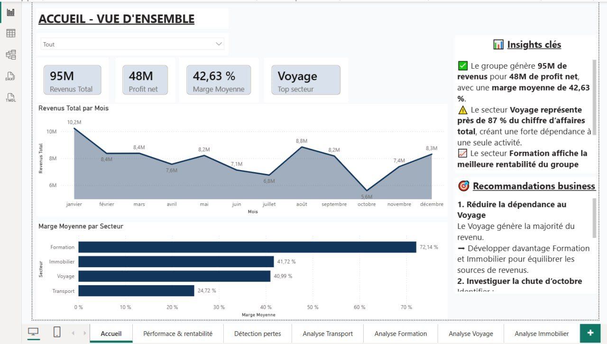
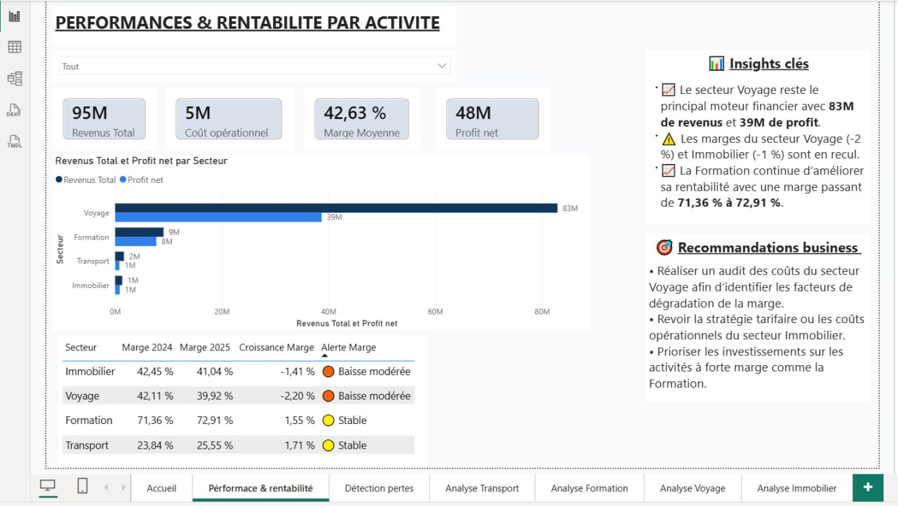
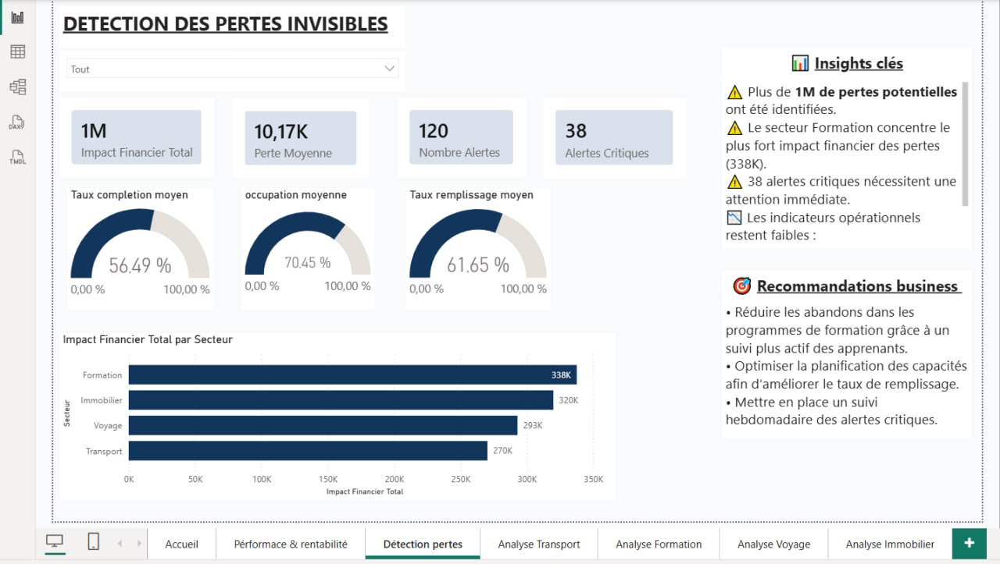
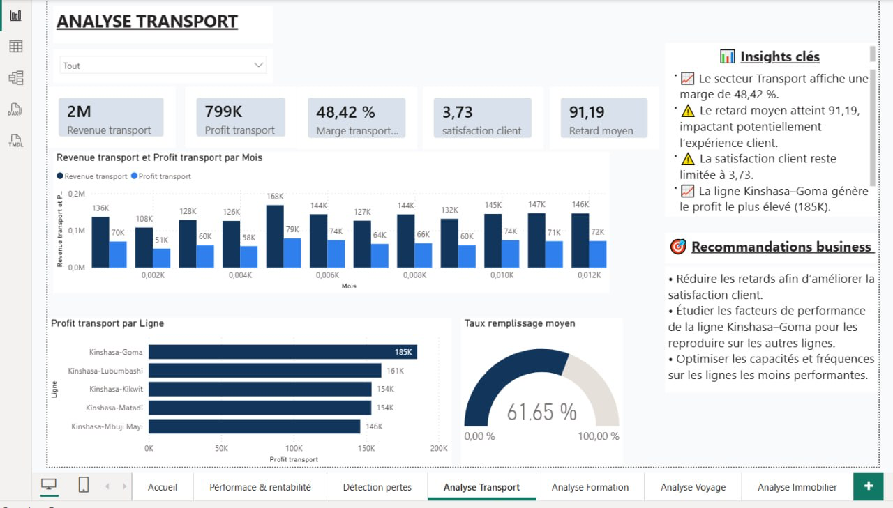
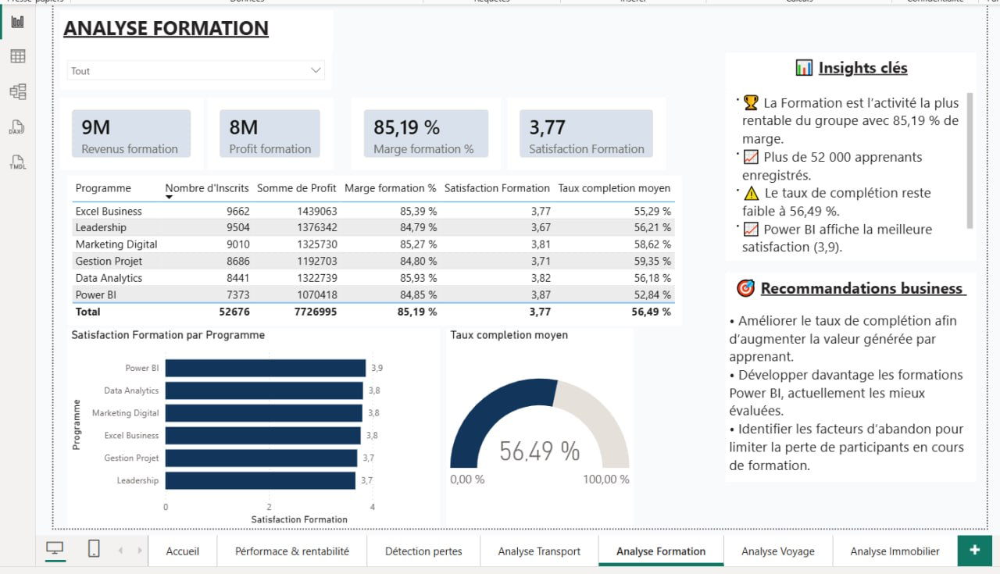
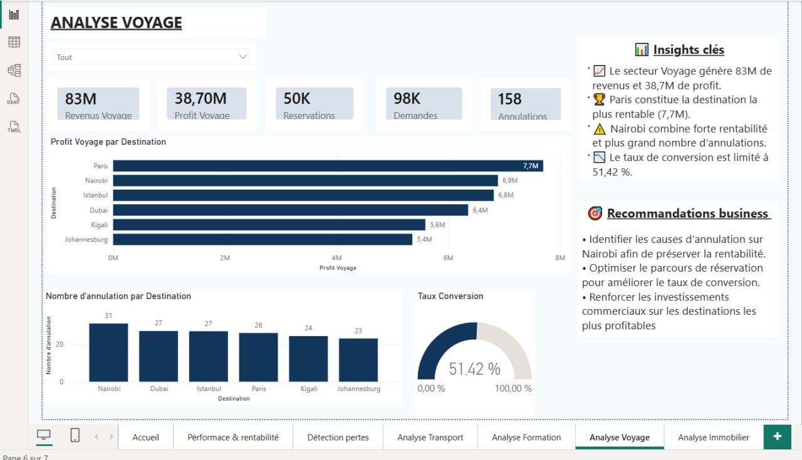
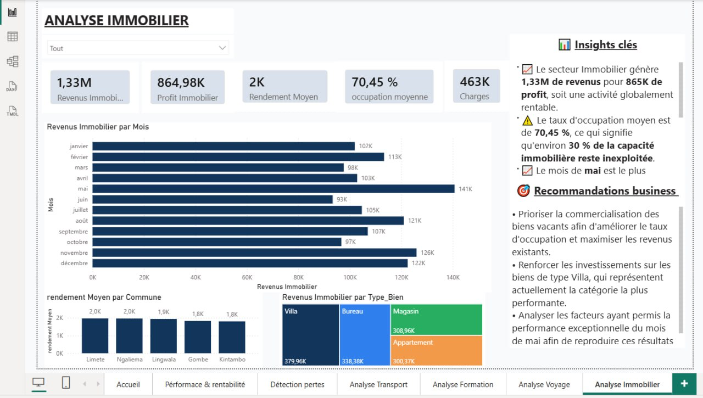

# 📊 Dashboard Analytique Multi-Secteurs – Power BI

Rapport Power BI de pilotage financier et opérationnel pour un groupe multi-activités (**Transport, Formation, Voyage, Immobilier**), avec suivi de la performance, détection des pertes invisibles et recommandations business par secteur.

---

## 🎯 Objectif du projet

Ce dashboard centralise les indicateurs clés de 4 secteurs d'activité d'un groupe afin de :
- Suivre les **revenus, profits et marges** globaux et par secteur
- Comparer la **rentabilité 2024 vs 2025** et détecter les baisses de marge
- **Détecter les pertes invisibles** (retards, annulations, faible taux de remplissage, abandons de formation…)
- Fournir des **insights et recommandations business** actionnables pour chaque activité

---

## 🗂️ Pages du rapport

| Page | Contenu |
|---|---|
| **Accueil – Vue d'ensemble** | KPIs globaux (revenus, profit net, marge moyenne), évolution mensuelle, marge par secteur |
| **Performance & rentabilité** | Comparatif revenus/profit par secteur, évolution des marges 2024 → 2025, alertes de marge |
| **Détection des pertes** | Impact financier des pertes, alertes critiques, taux de remplissage/occupation/complétion |
| **Analyse Transport** | Revenus, profit et marge par ligne, satisfaction client, retards, taux de remplissage |
| **Analyse Formation** | Performance par programme (inscrits, profit, marge, satisfaction, taux de complétion) |
| **Analyse Voyage** | Profit et annulations par destination, taux de conversion des réservations |
| **Analyse Immobilier** | Revenus mensuels, rendement par commune, revenus par type de bien |

---

## 📈 KPIs clés du groupe

- 💰 **95M** de revenus totaux
- 📈 **48M** de profit net
- 📊 **42,63 %** de marge moyenne
- 🏆 **Voyage** = secteur générant le plus de chiffre d'affaires (≈ 87 % du total)
- 🎓 **Formation** = secteur le plus rentable (marge de **72,91 %**)

---

## 🔍 Insights principaux

- ⚠️ Le secteur **Voyage** concentre la quasi-totalité du chiffre d'affaires, créant une forte dépendance à une seule activité
- 📉 Les marges **Voyage (-2,20 %)** et **Immobilier (-1,41 %)** sont en recul par rapport à 2024
- 📈 La marge **Formation** progresse (+1,55 %) et reste la plus rentable du groupe
- 🚨 **1M** de pertes potentielles identifiées, dont **38 alertes critiques** nécessitant une action immédiate
- 🚌 Le retard moyen du secteur Transport (91,19) impacte la satisfaction client (3,73/5)
- 🏠 Le taux d'occupation Immobilier (70,45 %) laisse ≈ 30 % de la capacité inexploitée

---

## 🛠️ Technologies utilisées

- **Power BI Desktop** (fichier `.pbix`)
- Modélisation de données et mesures **DAX**
- Visuels : cartes KPI, graphiques en barres/lignes, jauges (gauge), tableaux dynamiques

---

## 📁 Structure du dépôt

```
├── README.md
├── dashboard.pbix          # Fichier Power BI principal (à renommer selon ton fichier)
├── data/                   # Sources de données (à adapter selon ton projet)
└── screenshots/
    ├── accueil.png
    ├── performance_rentabilite.png
    ├── detection_pertes.png
    ├── analyse_transport.png
    ├── analyse_formation.png
    ├── analyse_voyage.png
    └── analyse_immobilier.png
```

> ⚠️ Pense à renommer `dashboard.pbix` avec le nom réel de ton fichier Power BI, et à ajuster le dossier `data/` selon tes sources (Excel, SQL, API…).

---

## 🚀 Comment utiliser ce projet

1. Cloner le dépôt :
   ```bash
   git clone https://github.com/<ton-utilisateur>/<ton-repo>.git
   ```
2. Ouvrir le fichier `.pbix` avec **Power BI Desktop**
3. Actualiser les données (**Accueil > Actualiser**) si de nouvelles sources sont connectées
4. Naviguer entre les pages via les onglets en bas du rapport

---

## 📸 Aperçu du dashboard

### Accueil – Vue d'ensemble


### Performance & rentabilité par activité


### Détection des pertes invisibles


### Analyse Transport


### Analyse Formation


### Analyse Voyage


### Analyse Immobilier


---

## 👤 Auteur

**[Ton nom]**
📧 [ton.email@example.com]
🔗 [LinkedIn / Portfolio]

---

## 📄 Licence

Ce projet est distribué sous licence [MIT](LICENSE) — libre à adapter selon tes besoins.
